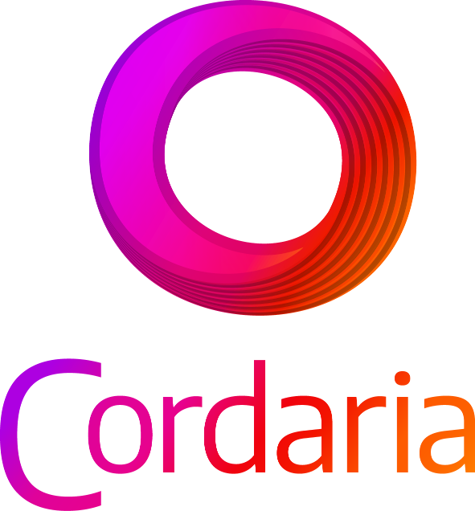

<div align="center" id="top"> 
  

  &#xa0;

</div>

<h1 align="center"><a href="https://lusacramento.github.io/cordariaapp">Já praticou Hoje?</a></h1>

<p align="center">
  <a href="#dart-sobre">Sobre</a> &#xa0; | &#xa0; 
  <a href="#sparkles-recursos">Recursos</a> &#xa0; | &#xa0;
  <a href="#rocket-tecnologias">Tecnologias</a> &#xa0; | &#xa0;
  <a href="#checkered_flag-iniciando">Iniciando</a> &#xa0; | &#xa0;
  <a href="#white_check_mark-compilando">Compilando</a> &#xa0; | &#xa0;
   &#xa0; | &#xa0;
  <a href="#keyboard-contribuindo">Contribuindo</a> &#xa0; | &#xa0;
  <a href="#memo-licença">Licença</a> &#xa0; | &#xa0;
  <a href="https://github.com/lusacramento" target="_blank">Autor</a>
</p>

<br>

## :dart: Sobre ##

## O que é?
Destinado à pessoas interessadas em iniciar o estudo do violão e guitarra e professores dessa arte, o projeto Cordaria é um aplicativo web com intuito de auxiliar a prática ao instrumento.

Desenvolvido pelo músico e programador Lu Sacramento, o projeto é fruto de uma pesquisa sobre novas metodologias e abordagens ao ensino à distância de música.

## O que Faz?

Sua função é gerar exercícios básicos de digitação com foco na técnica. Tais exercícios vem para auxiliar o educando a executar as notas dadas através de uma escrita de tablatura, cuja a linguagem é de fácil entendimento comparado a escrita de partitura.

Desta forma, o aluno poderá praticar junto ao auxílio de um “correpetidor” virtual, em qualquer momento e lugar!

## A Pesquisa
A pesquisa “Cordaria – Desenvolvimento de aplicação web para iniciação à prática do violão e guitarra” surge em um momento delicado da história mundial: a pandemia do Coronavírus – COVID 19. Compelidos a este problema, os profissionais da área da educação, sobre tudo com atuação na área da música enfrentam grandes desafios para conseguir adequar suas atividades para o ensino a distância. Parte deste desafio é devido a escassez de recursos tecnológicos que fogem da metodologia tradicional de ensino, muito das vezes, limitado a vídeos, textos, imagens e de forma repetida. Os problemas se amplificam com usuários oriundos da classe baixa, que tem uma limitação considerável de hardware e/ou baixa conexão de internet.

Utilizando meus conhecimentos de uma década como professor e alguns anos de desenvolvedor web, implementei uma aplicação para prática de exercícios básicos de violão e guitarra baseada em alguns métodos já experienciados por mim enquanto discente e docente. Com isso, Cordaria pretende ampliar as possibilidades metodológicas do ensino prático destes instrumentos num cenário EAD e oferecer uma oportunidade diferente para iniciação da arte do fazer musical, além de incentivar programadores e professores a pensar novas formas de aprendizagem.

Esta pesquisa foi possível devido ao apoio da Lei Emergencial de Incentivo à Cultura – Lei Aldir Blanc, Governo Federal, Ministério do Turismo e Secretaria Especial de Cultura, através da aprovação no Edital LAB no 14/2020 – “Seleção de Bolsistas para as Áreas Artísticas Técnicas e de Produção Cultural” promovido pela Secretaria de Cultura e Turismo de Minas Gerais – SECULT. 


## Equipe
<p>
Developer: Lu Sacramento;
<br>
Designer: Gabriel Barreto.
</p>
<br>

## :sparkles: Recursos ##

Treinamentos para os instrumentos:

:heavy_check_mark: Violão;\
:heavy_check_mark: Baixo;\
:heavy_check_mark: Guitarra;\
:heavy_check_mark: cavaquinho.

## :rocket: Tecnologias ##

As seguintes ferramentas usadas neste projeto:
### Frameworks
<p>
<a href="https://www.nuxtjs.org"></a>
<a href="https://vuejs.org/"></a>
</p>

### Estilo
<p>
<a href="https://getbootstrap.com/"></a>
<a href="https://bootstrap-vue.org/"></a>

### Backend
<a href="https://nodejs.org/en/"></a>
<a href="https://www.json.org/json-en.html"></a>
</p>

### Controle de Versão
<p>
<a href="https://git-scm.com/"></a>
</p>

### Editor de Código
<p>
<a href="https://code.visualstudio.com/"></a>
</p>

## :checkered_flag: Iniciando ##

### Rode sem a necessidade de instalar
Acesse -> [**https://lusacramento.github.io/cordariaapp**](https://lusacramento.github.io/cordariaapp). Caso tenhas interesse em colaborar com o desenvolvimento, peço favor que entre em contato conosco. Serás bem vinda sua colaboração!

## :white_check_mark: Compilando ##


Antes de inciar :checkered_flag:, você precisa ter [Git](https://git-scm.com) e [Node](https://nodejs.org/en/) instalados (Documentação em inglês).


```bash
# Clone este projeto
$ git clone https://github.com/lusacramento/Cordaria.git

# Accesse a pasta
$ cd cordaria

# Instale as dependências
$ yarn

# Rode o projeto
$ yarn run dev

# O servidor iniciará em <http://localhost:3000>
```
<br>

## :keyboard: Contribuindo ##
Estamos em processo de atualização de versão framework Nuxt, de v2 para v3 em um repositório a parte. Caso haja interesse, em contribuir, mande uma mensagem inbox! 


## :memo: Licença ##

Este projeto esta sobre licença do MIT. Para mais detalhes veja o arquivo da [LICENÇA](LICENSE.md).


Construído com :heart: by <a href="https://github.com/lusacramento" target="_blank">lusacramento</a>


<a href="#top">Voltar ao início</a>
